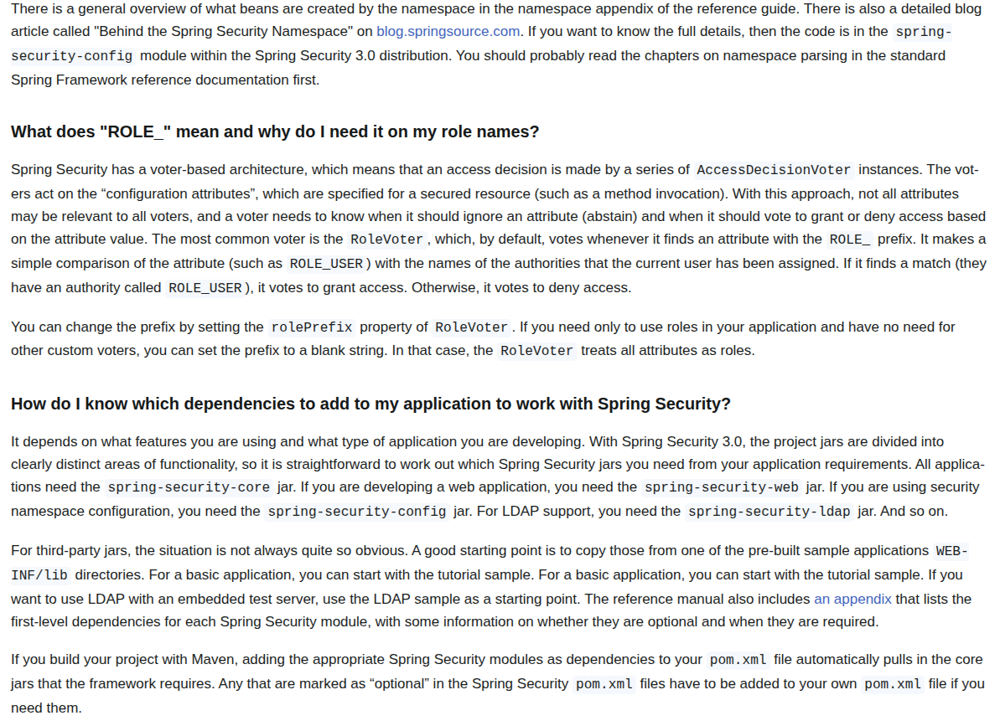
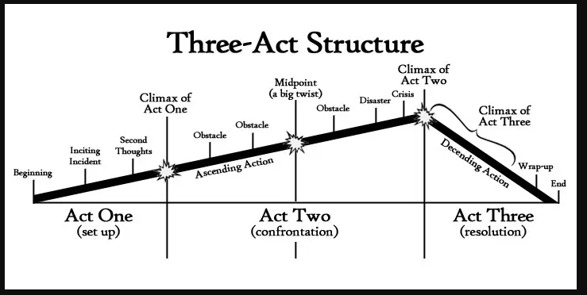
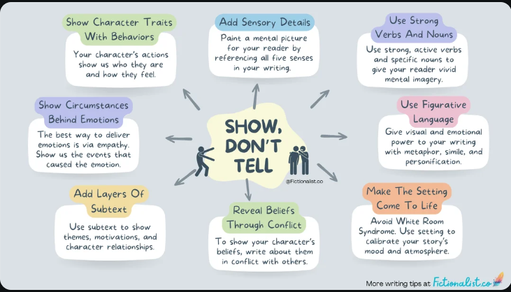
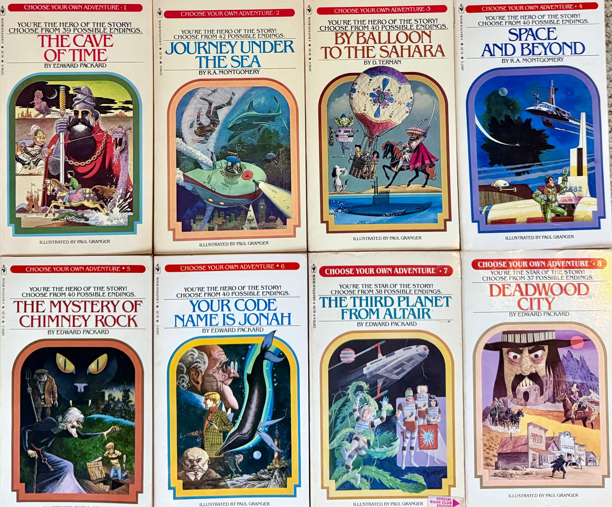

# Our Protagonist

Software engineer for *25* years.

. . .

wow...

. . .

                   ...you're old

. . .

- Full-time [Spring Security](https://github.com/spring-projects/spring-security) Contributor
- Pluralsight Course Author, mostly about security
- Amateur Writer and Poet

---

# The Quest

<!-- Some of Spring Security's older docs -->

---

<!--
- Frodo and LOTR
- Every story has a beginning, middle, and end
- Beginning - who the players are, what they are up against, introduction of a problem
- Middle - pursuit of resolution
- End - problem's solved, lessons learned, morals reinforced
-->

---

# Narrative Arc

- Beginning
- Middle
- End

---

# Know Your Reader

- "You" voice; "we" voice
- No passive voice
- Think "pair programming"

---

<!--
https://chatgpt.com/g/g-p-676ddd0dc704819194db0a8c1fed05bd/c/682bb89a-5f5c-8005-96c4-2c09732e2103

- Song tapping
- Beta Readers
- ChatGPT can pretend to be a Junior reader
-->

---

# Break the Curse of Knowledge

- Beta Readers
- ChatGPT

---

<!--
Teaching about the Hebrew temple
-->

---

# Show, Don't Tell

- Paint the picture
- Just-in-time Docs
- Use code samples, runnable if you can

---

---

# A Picture Is Worth 1000 Words

- Diagrams 
- Metaphor 
- Emoji's ✅

---

<!--
- Choose Your Own Adventure Story
-->

---

# Choose Your Own Adventure!

- Inline Links
- Navigation Links
- Small Pages
- "Jump to Recipe" button

---

# Choose Your Own Adventure!

> What would be the best medium of storytelling to tell your life story? Ideas: Shadow puppetry, rock ballad, interpretive dance, or perhaps back to the good old campfire tale. Be creative and surprise me!

. . .

I think it would be fun to have a computer program that would tell my story by running it. It would probably be something of a choose your own adventure, and you could either pick the route I *did* go or the route I *didn't* and the program would predict what might have happened had I chosen another path.

. . .

Also, you could learn my story through a meta-analysis of the code itself. Like maybe the early parts of the code are simple and problematic, then later parts of the code are using patterns but are overly complex, then later parts are simple, unflashy, and do the job well.

. . .

Maybe some of my story would be hidden in the Git comments, in JavaDoc links, and in a stenographized favico.

. . .

It would also contain a virus that, when you ran the program, it would hypnotize you to crave Kentucky Fried Chicken fortnightly. 

---

# Embrace Rewriting

- The first version is for you
- Kill Your Darlings
- Don't be afraid to delete the whole thing and try again

---

# DEMO

[Spring Security Reference](https://docs.spring.io/spring-security/reference/index.html)

---

# Let's Review

- Beginning, Middle, End
- Know Your Reader
- Break the Curse of Knowledge
- Show, Don't Tell
- Picture > 1000 Words
- Choose Your Own Adventure
- Embrace Rewriting

---

# Thanks!

https://github.com/jzheaux/big-mountain-2025

Josh Cummings - https://bsky.app/profile/jzheaux.bsky.social

---

# Fin
